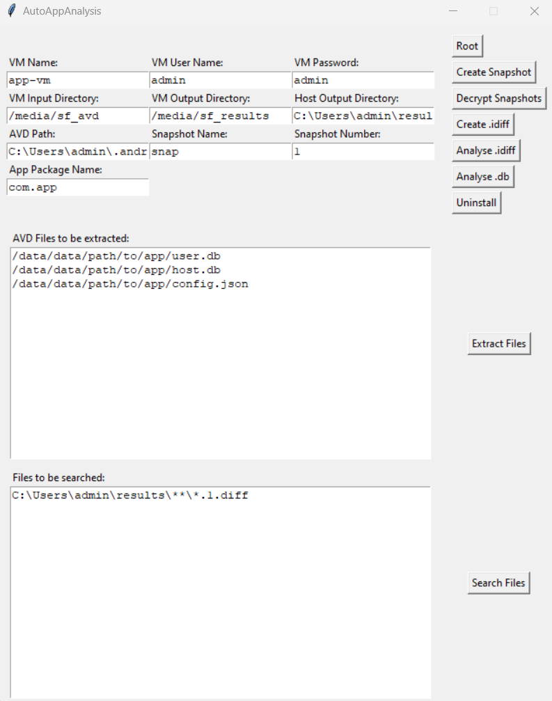

# Description

Automation GUI for Android App Analysis

# Installation

`pip install autoappanalysis`

# Usage

Create a config file with the following schema:

```json
// config.json
{
  "log": "autoappanalysis.log",                                // Path to log file
  "pkgName": "com.app",                                        // Package Name
  "vm": "app-vm",                                              // Name of the VM
  "user": "admin",                                             // User Name 
  "pw": "admin",                                               // Password
  "input": "/media/sf_avd",                                    // Path to AVD shared folder on VM
  "output": "/media/sf_results",                               // Path to result shared folder on VM
  "outputHost": "C:\\Users\\admin\\results",                   // Path to result shared folder on host
  "snapshot": "C:\\Users\\admin\\.android\\avd\\analysis.avd", // Path to AVD shared folder on host
  "comparison": [                                              // Array of objects to provide different 
        {                                                      // comparison setup. 
            "name": "01_action_install",                       // Each object holds a comparison name,        
            "first": "init",                                   // a starting snapshot (first) to which the other 
            "second": ["install"],                             // snapshots (second) will be compared against
            "noise": "noise"                                   // name of the noise snapshot
        },                                                      
        {
            "name": "02_action_first_start",
            "first": "install",
            "second": ["first_start"],
            "noise": "noise_install"
        },
        {
            "name": "03_action_guest_login",
            "first": "first_start",
            "second": ["continue_as_guest"],
            "noise": "noise_first_start"
        }
  ],
  "files": [                                                  // Full Paths to files which are going to be
        "/data/data/path/to/app/user.db",                     // extracted for each snapshot
        "/data/data/path/to/app/host.db",
        "/data/data/path/to/app/config.json"
  ],
  "search": {
        "files": [                                           // Path to files which shall be searched
                "C:\\Users\\admin\\results\\**\\*.1.test",   // Accepts globe patterns
        ],
        "actions": [                                        // Each action specified here will be
            {                                               // applied to each files listed before
                "name": "All Occurences",
                "method": "or",
                "words": "appname",
                "format": "wln"
            },
            {
                "name": "Interesting FileTypes",
                "method": "or",
                "words": ".db,.json,.xml,.yml",
                "format": "wln"
            }
        ]
  }
}
```


# Example

`python -m autoappanalysis -c config.json`





| Button | Description |
| --- | ---|
| Root | Starts adbd as root |
| Create Snapshot | Create a AVD Snapshot with `Snapshot Name` and `Snapshot Number` and extract all files given by `AVD Files to be extracted` |
| Decrypt Snapshots | Decrypts all snapshots in `VM Input Directory` and save the `.raw` in `VM Output Directory + /decrypted` |
| Create .idiff | Creates `.idiff` files from the given comparison in config.json and save them in `VM Output Directory + /actions` |
| Analyse .idiff | Analyses all `.idiff` in `VM Output Directory + /actions` and save the results there |
| Analyse .db | Analyse all `AVD Files to be extracted` sqlite databases based on given comparison rules in config.json |
| Uninstall | Uninstalls the App given by `App Package Name` |
| Extract Files | Extract all files given by `AVD Files to be extracted`. In order to work, `Root` button need to be pushed first. |
| Search Files | Search given files by provided config and save results within the given paths |


# License

MIT